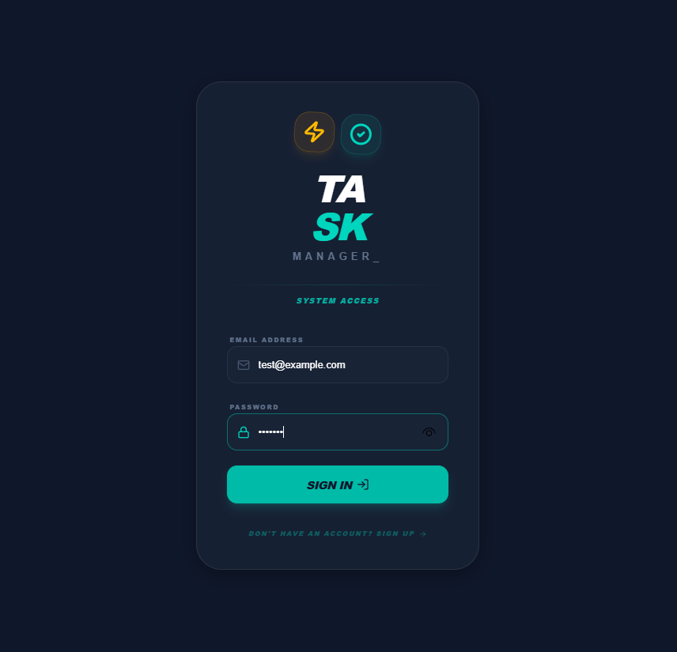
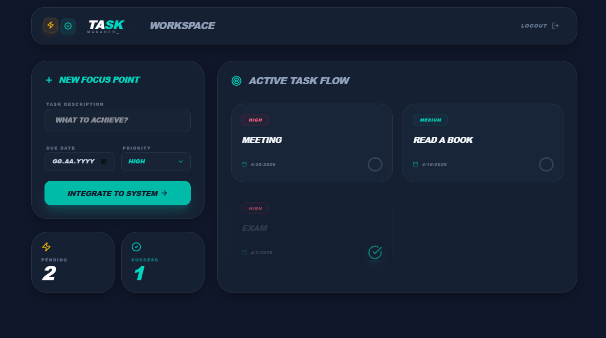
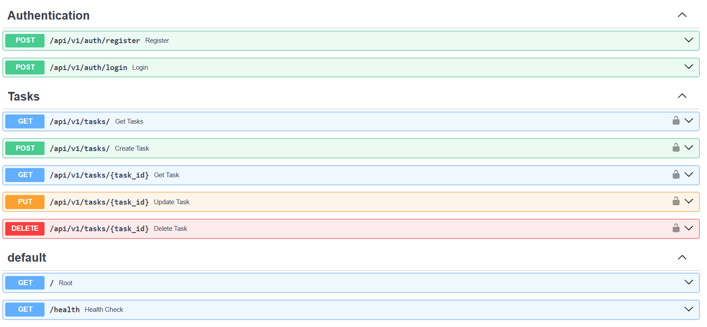

# 🚀 Full-Stack Task Management System


A modern, secure, and scalable task management platform. This project features a high-performance asynchronous **FastAPI** backend designed with **Clean Architecture** principles and a sleek, responsive **React (TypeScript)** frontend.

---

## 📸 Application Preview

Take a look at the modern user experience provided by the system:

### 🔐 1. Secure Access (Login & Authentication)
System access is protected by a modern login screen using JWT-based tokens and Bcrypt password hashing.

<p align="center">
  
</p>

### 👤 2. User Workspace (Dashboard)
A personalized dashboard where users can manage, prioritize, and track their own specific tasks.

<p align="center">
  
</p>

### 🛠 3. API Documentation (Swagger UI)
Real-time interactive Swagger documentation for testing backend services and exploring endpoints.

<p align="center">
  
</p>

---

## ✨ Key Features

* **🛡️ JWT Authentication:** Secure session management following OAuth2 standards.
* **👤 User-Based Data Isolation:** Multi-tenant logic ensuring users can only interact with their own data.
* **⚡ Async Performance:** High-speed database operations powered by FastAPI and SQLAlchemy 2.0.
* **🐘 Relational Database:** Robust data structures with PostgreSQL and version control via Alembic migrations.
* **🎨 Modern UI/UX:** A user-friendly interface inspired by Neumorphic and Dark Mode trends, built with React & TypeScript.
* **🐳 Docker Orchestration:** The entire stack (Frontend, Backend, DB) can be launched with a single command.

---

## 🏗 Project Structure

The project follows a **Monorepo** pattern:

```plain
task-management-api/
├── assets/             # Documentation screenshots
├── backend/            # FastAPI, PostgreSQL, SQLAlchemy, Alembic
│   ├── app/            # Business Logic (Routers, Services, Models)
│   └── dockerfile      # Backend Docker configuration
├── frontend/           # React, TypeScript, Vite, Tailwind/CSS
│   └── src/            # Frontend source code
└── docker-compose.yml  # Full-stack system orchestration
🚀 Quick Start
Running with Docker (Recommended)
The fastest way to get the system running locally is using Docker:

Clone the repo: git clone https://github.com/eminosmanatci/task-management-api.git

Setup Env: Create a .env file in the backend/ directory.

Launch:

Bash
docker-compose up --build
Manual Installation
Backend:

Bash
cd backend
python -m venv venv
# Activate venv (Windows: venv\Scripts\activate)
pip install -r requirements.txt
alembic upgrade head
uvicorn app.main:app --reload
Frontend:

Bash
cd frontend
npm install
npm run dev
📄 License
This project is licensed under the MIT License.


---

### 🏁 Ne yapmalısın?
1. Yukarıdaki kodu kopyala ve `task-management-api/README.md` dosyasına yapıştır.
2. Kaydet ve kapat.
3. Terminale şu komutları yaz:

```powershell
git add README.md
git commit -m "Docs: Update README with English version and screenshots"
git push origin main
